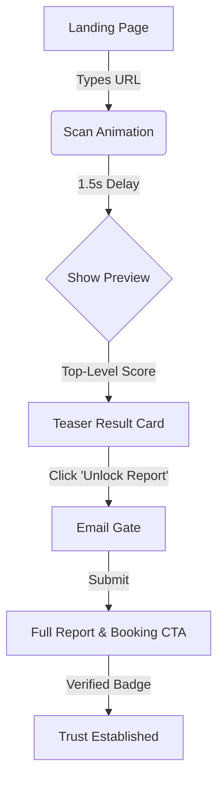
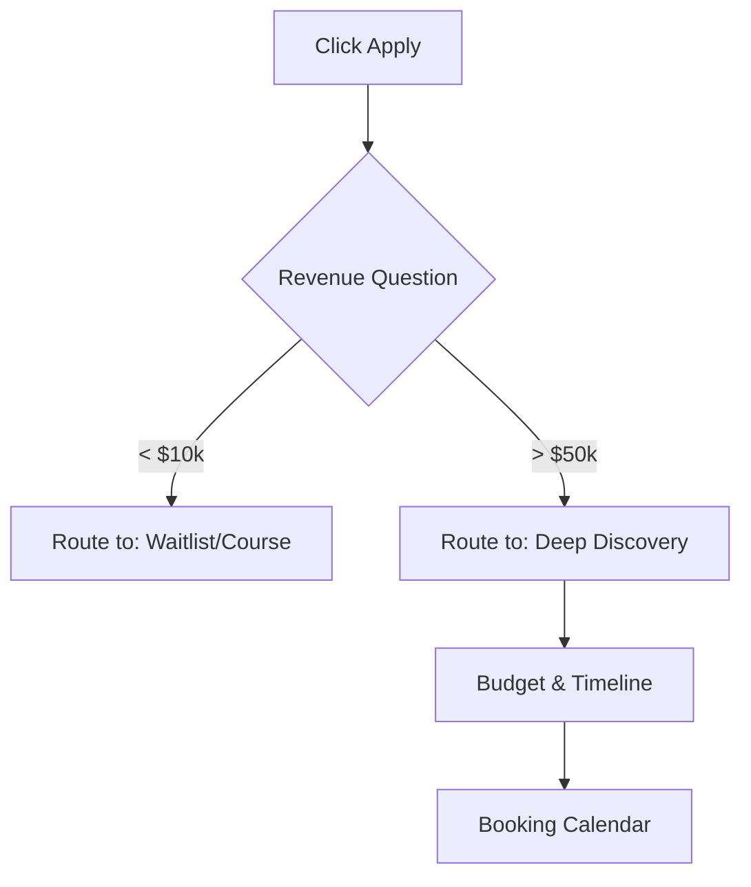

# UX Design Specification marketing-test-site

**Author:** Sultan
**Date:** 2026-02-01

---

<!-- UX design content will be appended sequentially through collaborative workflow steps -->

## 1. Executive Summary

### Project Vision
Riffat Labs 2.0 is a premium, high-performance lead generation platform for a high-end AI automation agency. It differentiates itself through a "Glassmorphism 3.0" aesthetic that signals technical sophistication, while grounding that style in verifiable trust via schema-backed results and instant audits. The goal is to make the user feel they are interacting with the future of marketing automation.

### Target Users
*   **The Skeptical CMO:** High-value decision maker. Overwhelmed by AI hype. Values verified data, case studies, and instant proof of competence.
*   **The Agency Founder:** Looking to scale operations. Needs transparency and clarity on "how it works."

### Key Design Challenges
*   **Trust vs. Style:** The UI must be visually stunning (Glassmorphism) without looking like a "fly-by-night" crypto project. It needs to feel substantial and professional.
*   **Performance Constraints:** Implementing complex visual effects (blur, noise, gradients) while adhering to strict Core Web Vitals (LCP < 0.8s) and bundle size limits.
*   **Complexity Management:** The "No-Click Audit" and "Apply Wizard" involve complex logic that must be presented simply on mobile devices.

### Design Opportunities
*   **"Verified" Visual Language:** Creating a distinct visual treatment for "Verified Data" (e.g., gold/neon glowing badges) that users learn to trust.
*   **The "Magic" Scan:** Designing the Audit Tool animation to feel computational and valuable, turning a wait time into a brand moment.

## 2. Core User Experience

### Defining Experience
The core experience is defined by **"Effortless Competence."** The user (Skeptical CMO) enters the site and is immediately met with a high-performance "Audit Hero" that demonstrates value before they click a single button. The journey follows a strict "Show, Don't Tell" philosophy: instead of reading marketing copy, the user interacts with the Results Engine and Audit Tool to *verify* the agency's claims themselves.

### Platform Strategy
*   **Primary Platform:** **Mobile Web (Portrait).** The design must be "Thumb-First." Complex layouts (Results Grid) must collapse elegantly into vertical stacks without losing the "Glassmorphism" polish.
*   **Secondary:** Desktop Web. Used for deep-dive reading of case studies.
*   **Constraint:** No native app features; must rely on PWA capabilities for "App-like" feel on mobile navigation.

### Effortless Interactions
1.  **The "No-Click" Audit:** The audit logic triggers progressively as the user scrolls or hovers, lowering the barrier to entry. "Teaser" data appears instantly.
2.  **Smart Form Logic:** The Apply Wizard uses conditional logic to skp irrelevant questions. If "Revenue > $10M" is selected, the "Budget" question defaults to "Custom/Enterprise" and skips the low-tier options.

### Critical Success Moments
1.  **The "First Paint":** The site *must* load the Glassmorphism Hero in <0.8s. If it lags, the "High-Performance" claim is invalidated.
2.  **The "Trust" Hover:** When a user inspects a "Verified" badge, the tooltip must show raw, undeniable data (dates, schema validation), converting skepticism into trust.

### Experience Principles
1.  **Performance is Luxury:** Speed is the primary design asset. If an animation causes jank, it is cut.
2.  **Radical Transparency:** Every claim is backed by click-through proof.
3.  **Futuristic Polish:** The interface should feel like it's from 2030 (Glass, Neon, Motion) to signal AI mastery.

## 3. Desired Emotional Response

### Primary Emotional Goals
**"Relief through Competence."**
*   **The Skeptical CMO:** Feels *"Finally, someone who actually knows what they're doing and isn't just using buzzwords."*
*   **The Agency Founder:** Feels *"This is the system I've been looking for to fix my chaos."*

### Emotional Journey Mapping
1.  **Discovery (First 3s):** *Intrigue.* "This looks different. It's fast. It's beautiful." (Breaking the 'generic SaaS' fatigue).
2.  **Audit (Action):** *Surprise.* "Wait, it actually analyzed my site? This isn't a fake progress bar."
3.  **Verification (Deep Dive):** *Confidence.* "Okay, they have real data. These case studies are verified."
4.  **Booking (Conversion):** *Empowerment.* "I'm not being sold to; I'm applying to work with the best."

### Micro-Emotions
*   **Trust > Skepticism:** Achieved by the "Verified" badges glowing only when data is confirmed.
*   **Calm > Anxiety:** The "Glassmorphism" aesthetic uses deep, dark backgrounds to reduce eye strain and create a "night mode" vibe suitable for late-night executive browsing.

### Design Implications
*   **Relief:** Use generous whitespace and "glass" depth to unclutter complex data.
*   **Confidence:** Use "monospaced" fonts for data points (numbers, dates) to make them feel like raw, unmanipulated engineering data.
*   **Intrigue:** Use subtle, continuous background motion (nebula/aurora effects) that makes the site feel "alive" without distracting from content.

### Emotional Design Principles
1.  **Dark Mode Default:** To signal "Developer/Pro" tool vibes vs "Salesy" white backgrounds.
2.  **Data as Art:** Treating metrics and charts as the primary visual focus, beautifying the "truth."

## 4. UX Pattern Analysis & Inspiration

### Inspiring Products Analysis
*   **Linear:** The "Gold Standard" for dark mode interfaces. We will borrow their subtle use of gradients to guide attention without overwhelming the user.
*   **Stripe:** The benchmark for "Developer Trust." We will adapt their "Code Block" and API visualization styles to make our Audit Tool feel technical and verified.
*   **Vercel:** Key inspiration for "Instant Performance." We will mimic their minimalist layout that emphasizes speed and deployment status.

### Transferable UX Patterns
1.  **The "Bento Grid":** Organizing case studies and operational metrics into modular, bento-box style glass panels. This is naturally responsive and handles variable content density well.
2.  **Gradient Borders:** Using 1px gradient borders to define component boundaries instead of solid backgrounds. This creates a "light hitting glass" effect.
3.  **Shimmer Hovers:** Micro-interactions where hovering over a card reveals a subtle light shimmer, reinforcing the glass metaphor.

### Anti-Patterns to Avoid
1.  **Scroll-Jacking:** We will NOT override native browser scrolling. The "glossy" feel must come from CSS filters (backdrop-blur), not JavaScript scroll manipulation.
2.  **Fake Loaders:** The Audit Tool must show *real* progress. If the API is fast, show it fast. No artificial delays to feign complexity.

### Design Inspiration Strategy
*   **Adopt:** Linear's "Glow" effects for active states (buttons, toggles).
*   **Adapt:** Stripe's "Code Block" visuals for our "Schema Verification" tooltips (re-styled for dark mode).

## 5. Design System Foundation

### 1.1 Design System Choice
**Customized Shadcn UI (Zinc-950 Base)**
We will use a copy/paste component architecture based on **Shadcn UI** (Radix Primitives + Tailwind CSS), customized heavily for our Glassmorphism aesthetic.

### Rationale for Selection
1.  **Ownership:** Unlike a rigid library (MUI), we own the component code. This is critical for implementing our custom "Gradient Borders" and "Glass Panels" directly into the base components.
2.  **Performance:** Zero-runtime CSS via Tailwind ensures we meet our strict Bundle Size and LCP targets.
3.  **Accessibility (a11y):** Radix Primitives handle the complex keyboard navigation and ARIA roles for our Dialogs and Tabs, ensuring we don't sacrifice usability for style.

### Implementation Approach
*   **Base:** Start with `npm init shadcn-ui@latest`.
*   **Theming:** Configure `tailwind.config.js` with our "Zinc-950" dark palette.
*   **Icons:** Use `lucide-react` for crisp, technical vector icons.

### Customization Strategy
*   **Glass Utility:** We will create a `glass` utility class: `@apply bg-zinc-950/40 backdrop-blur-xl border border-white/10`.
*   **Gradient Borders:** We will build a custom `<GradientBorder />` wrapper component for key UI elements.

## 6. Detailed Core Experience

### 2.1 The Defining Experience
**The "Instant Verify" Loop.**
The defining moment is the transition from "Visitor" to "Verified Lead" via the No-Click Audit. The user enters their URL, and instead of a generic loading spinner, the UI transforms into a high-tech scanner that visually "reads" their site's metadata. The payoff is immediate: a "Verified" badge that visually unlocks high-value content (exclusive case studies), making the user feel they have "qualified" to see the good stuff.

### 2.2 User Mental Model
*   **Old Model:** "I give my email -> I get spam -> I get a generic PDF later." (Skepticism/Friction)
*   **New Model:** "I input my URL -> The AI 'sees' me -> I get 'Verified' -> I get value *now*." (Magic/Competence)

### 2.3 Success Criteria
1.  **Speed to Magic:** The scan animation must take <1.5s. Fast enough to be impressive, slow enough to be believable.
2.  **No-Gate Value:** The first insight (e.g., "Schema Found") must be revealed *before* any email gate.
3.  **Visual Payoff:** The transition from "Scanning" (Blue/Pulse) to "Verified" (Gold/Glow) must feel like a "Level Up."

### 2.4 Novel UX Patterns
*   **The "Unlock" Metaphor:** Using the audit result to visually "unblur" the Case Studies section below. This borrows from video game UI (unlocking a level) rather than standard B2B marketing (filling a form).

### 2.5 Experience Mechanics
1.  **Initiation:** Hero Section -> Large, glowing input: "Audit your Agency AI Readiness."
2.  **Interaction:** User types URL -> Hits Enter.
3.  **Feedback:**
    *   Input border pulses with a gradient.
    *   Text cycles: "Connecting..." -> "Analyzing Metadata..." -> "Validating Schema..."
4.  **Completion:**
    *   The "Audit Card" flips to reveal a score.
    *   The "Case Studies" section below unblurs.
    *   A "Verified" badge creates a trust anchor.

## 7. Visual Design Foundation

### Color System
*   **Background:** `zinc-950` (#09090b). Dark, rich, allows for depth/shadows.
*   **Primary:** `blue-500` (#3b82f6). Electric, active, focused.
*   **Accent/Verified:** `amber-400` (#fbbf24) or `emerald-400` (#34d399). Used for "Verified" confirmation.
*   **Glass Surface:** `bg-white/5` with `backdrop-blur-xl`.
*   **Glass Border:** `border-white/10`.

### Typography System
*   **Primary Font:** **Inter Tight**. Modern, tight tracking for headlines, highly legible for body copy.
*   **Monospace Font:** **JetBrains Mono**. Used for all data points, audit scores, and "technical" metadata to signal engineering precision.

### Spacing & Layout Foundation
*   **Base Unit:** 4px.
*   **Container Radius:** `rounded-xl` (12px) for cards.
*   **Input Radius:** `rounded-lg` (8px).
*   **Grid:** Standard 12-column grid, but UI is organized into "Bento" panels rather than strict columns.

### Accessibility Considerations
*   **Text Contrast:** White text (`text-zinc-50`) on dark backgrounds ensures >4.5:1 ratio.
*   **Focus States:** All interactive glass elements will have a `ring-2 ring-blue-500` focus state for keyboard users.
*   **Motion Reduction:** The "Nebula" background must respect `prefers-reduced-motion` settings (pause animation).

## 8. Design Direction Decision

### Design Directions Explored
We explored three variations:
1.  **Deep Glass:** High-contrast dark mode with rich glassmorphism and neon accents.
2.  **High-Voltage:** Stronger neon presence, cyberpunk aesthetic.
3.  **Swiss Grid:** More minimalist, cleaner lines, less "glow."

### Chosen Direction
**Deep Glass** (Variation 1)

### Design Rationale
*   **Balance:** It strikes the perfect balance between "Futuristic/AI" (invoking the 'magic' of the audit) and "Trustworthy/Professional" (clean lines, organized data).
*   **Differentiation:** It stands out immediately from the "White SaaS Standard" competitors.
*   **Focus:** The dark background allows the "Verification Badges" (Gold/Green) to pop significantly, drawing the eye to the trust signals.

### Implementation Approach
*   **CSS:** Heavy use of `backdrop-blur` and `bg-opacity`.
*   **Assets:** Subtle radial gradients for backgrounds (Nebula effect).
*   **Interaction:** "Scanner" animations on hover and input focus.

## 9. User Journey Flows

### Journey 1: The "Audit Loop" (Lead Magnet)
Goal: Convert Skeptic -> Verified Lead.

### Journey 2: The "Apply Wizard" (Qualification)
Goal: Filter low-quality leads efficiently.

### Flow Optimization Principles
1.  **Value First:** Show the "Efficiency Score" *before* the email gate to prove the tool works.
2.  **Smart Routing:** Don't waste sales team time on leads that can't afford the service; route them to automated products instantly.
3.  **Always Be Closing:** Every page footprint (footer/bottom) must re-trigger the Audit Hero.

## 10. Component Strategy

### Design System Components (Shadcn UI)
We will leverage standard **Shadcn UI** components for foundational elements:
*   **Forms:** `Input`, `Select`, `Textarea` (styled with glass backgrounds).
*   **Overlay:** `Dialog` (Modals), `Sheet` (Mobile Menu), `Tooltip`.
*   **Feedback:** `Badge` (Status), `Progress` (Audit Loading), `Toast` (Notifications).

### Custom Components
1.  **`<AuditHero />`**
    *   **Purpose:** The primary conversion engine.
    *   **States:** `Idle` (Input), `Scanning` (Pulse Animation), `Complete` (Result Card).
    *   **Complexity:** High. Requires CSS animation sequencing.
2.  **`<BentoGrid />`**
    *   **Purpose:** Responsive layout engine for Case Studies.
    *   **Usage:** Wraps child cards in a `grid-auto-flow` container.
3.  **`<SmartWizard />`**
    *   **Purpose:** Multi-step form with conditional branching logic.
    *   **State:** Uses `xstate` or `useReducer` to manage navigation history and data preservation.

### Implementation Roadmap
1.  **Phase 1 (Core):** `AuditHero` + `GlassPanel` Utility. (The "Wow" Factor).
2.  **Phase 2 (Support):** `BentoGrid` + `Section` Wrappers. (The Structure).
3.  **Phase 3 (Logic):** `SmartWizard` + `SchemaTooltip`. (The Brains).

## 11. UX Consistency Patterns

### Button Hierarchy
1.  **Primary (Neon):** `bg-blue-600` + `shadow-glow`. Used for "Scan Now" and "Book Call."
2.  **Secondary (Glass):** `bg-white/5` + `border-white/10`. Used for "Read Case Study" and "Learn More."
3.  **Tertiary (Text):** Text link with hover underline. Used for footer links.

### Input Patterns (Glass Forms)
*   **Visibility:** Inputs must use `border-white/20` (light gray) borders in default state to ensure visibility on dark backgrounds.
*   **Focus:** Active inputs get a `ring-2 ring-blue-500` and `bg-white/10` fill to clearly indicate "typing mode."

### Feedback Patterns
*   **Toast Notifications:** Non-blocking messages (e.g., "URL Copied", "Report Ready") appear at bottom-right.
*   **Skeletons:** Loading states must use a "shimmering shape" of the content (Skeleton) rather than a spinner, to preserve layout stability (CLS).

### Mobile Considerations
*   **Touch Targets:** All interactive elements (buttons, inputs) must be at least `44px` tall.
*   **Thumb Zone:** Key actions (Save, Continue) in the Wizard should be fixed at the bottom of the viewport on mobile ease of access.

## 12. Responsive & Accessibility Strategy

### Responsive Strategy
We adopt a **Mobile-First** implementation strategy:
1.  **Mobile (Default):** Single-column vertical stack. "Bento" cards stack sequentially. Nav collapses to bottom bar or hamburger.
2.  **Tablet (MD):** 2-column grid. Sidebar navigation becomes available.
3.  **Desktop (LG+):** Max-width 1400px centered. "Dashboard" views (Audit Report) expand to show high-density data visualizations.

### Breakpoint Strategy
*   `xs`: 0px - 639px (Mobile Stack)
*   `sm`: 640px - 767px (Large Mobile)
*   `md`: 768px - 1023px (Tablet/Grid Start)
*   `lg`: 1024px - 1279px (Desktop Standard)
*   `xl`: 1280px+ (Wide Dashboard)

### Accessibility Strategy (WCAG 2.1 AA)
*   **Contrast enforcement:** `bg-white/5` overlays must always use `text-white` (High Contrast) type, never gray.
*   **Reduced Motion:** Tailwind's `motion-safe:` prefix will be used for all large animations (Scan, Nebula).
*   **Focus Management:** `focus-visible` ring on glass elements must be opaque blue, not transparent.

### Testing Strategy
*   **Automated:** `axe-core` integrated into Playwright tests to catch ARIA errors on commit.
*   **Manual:** "No Mouse" days—developers must test critical flows (Apply Wizard) using only keyboard navigation once per sprint.

